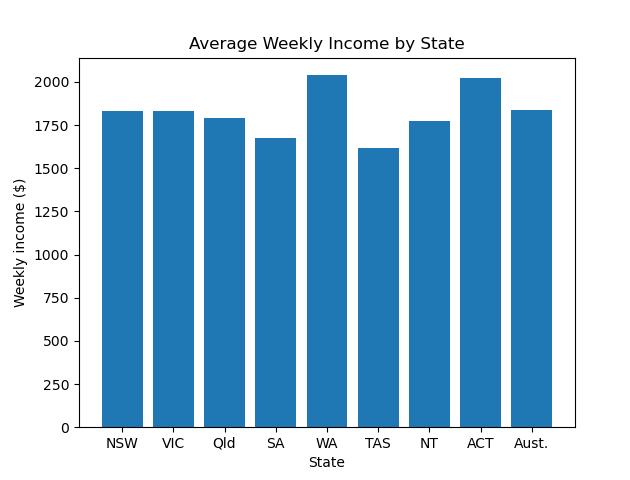
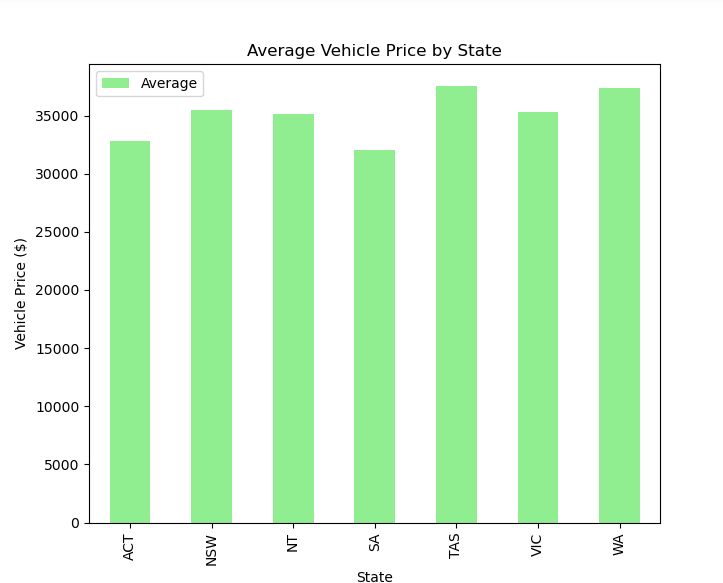
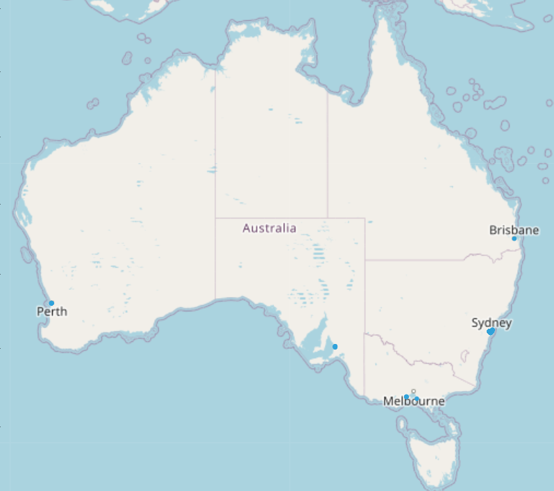
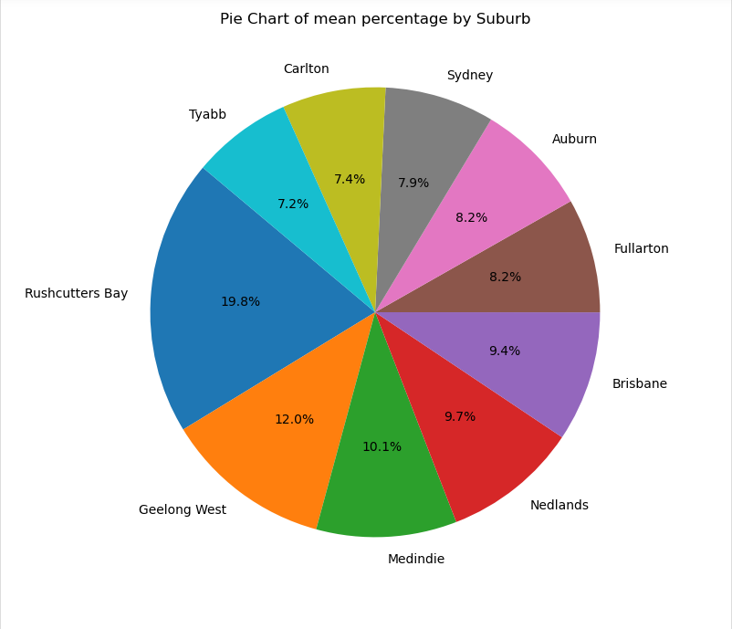
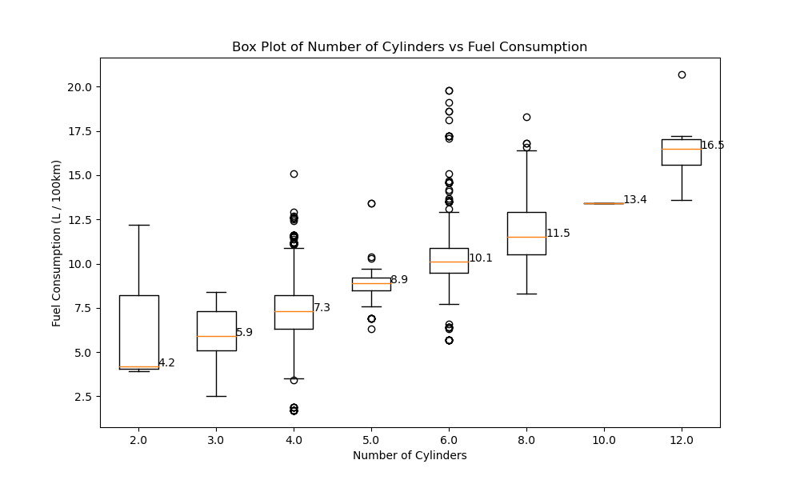
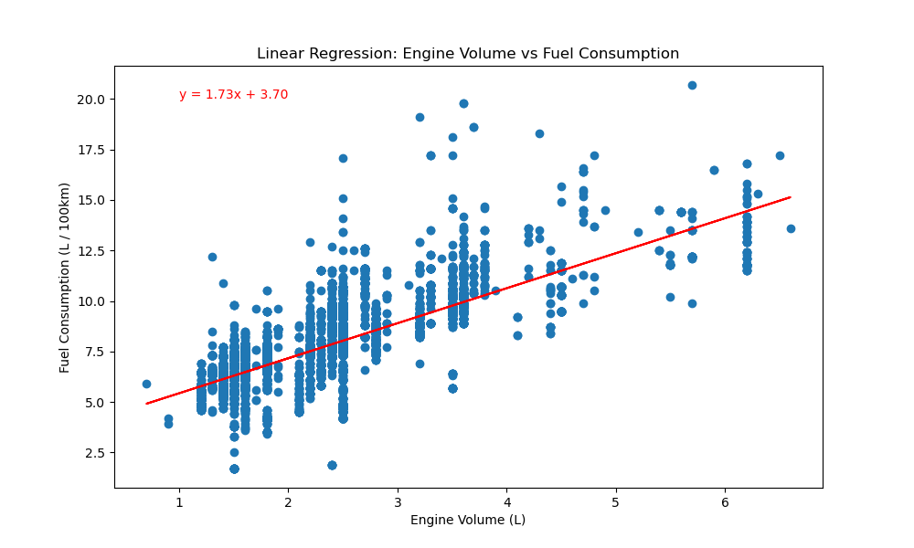
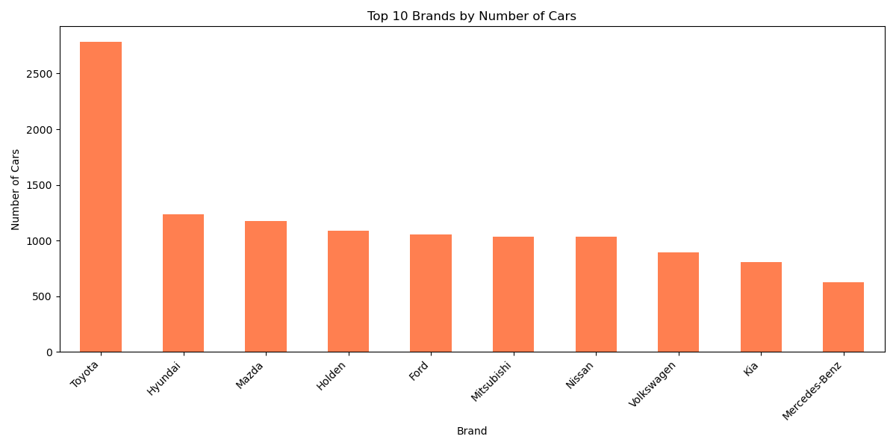
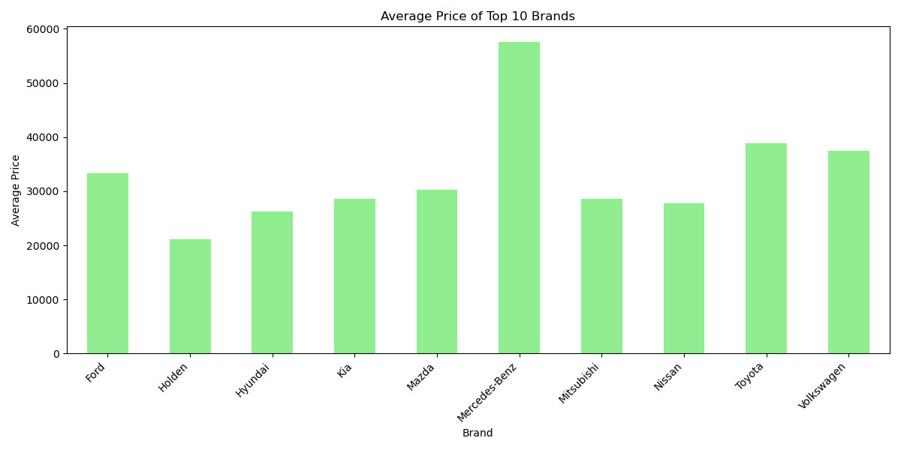
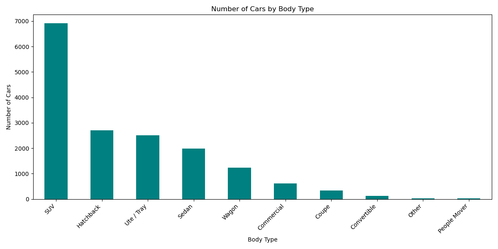
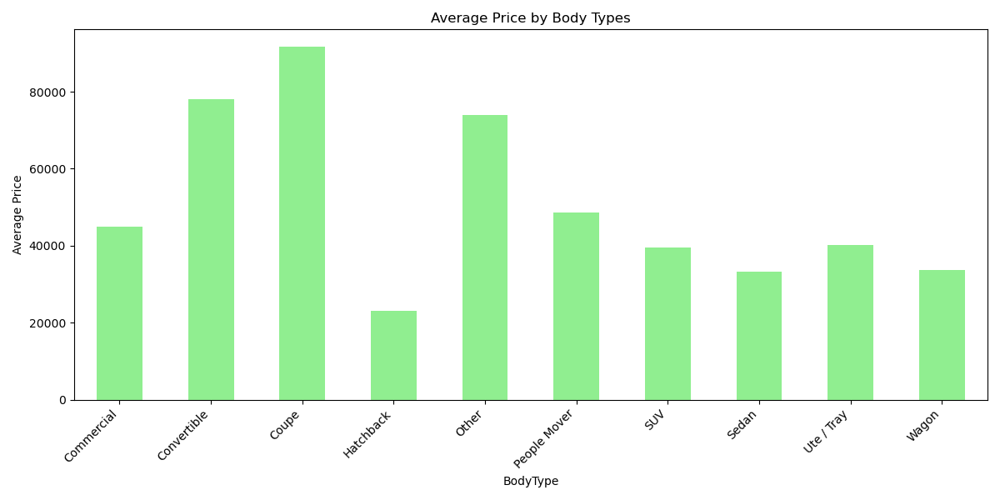

# Project1Group5

Project Title: Australian Vehicle Trends

Team Members: Dominik Foale, Anrie Santos, Husna Nasution

Project Outline: Looking at recent vehicle listing data in Australia, we aim to perform exploratory data analysis to determine relationships between different variables and find trends in vehicle sales.

Research Questions to Answer:
1. How does car price vary by location and location average income?
2. How much does engine size (engine volume and number of cylinders) affect fuel consumptions?
3. What are the dominant vehicle brands and types in the Australian market?

Datasets to be used:
Australian Vehicle Prices​ - https://www.kaggle.com/datasets/nelgiriyewithana/australian-vehicle-prices/code
Average weekly ordinary time earnings, full-time adults by state, original​ - Australian Bureau of Statistics data
Australia Geo Postcode​ - https://gist.github.com/randomecho/5020859

Rough Task Breakdown:
Anrie - Q1
    Import relevant libraries
    Cleaning the datasets
    ABS
    Aus Vehicle Prices
    Postcode Geo
    Aggregate the prices of all the cars grouped by Suburb (mean, mode, median, stderr, var, sem)
    Merged the datasets from the Vehicle prices (aggregated) to the Postcode Geo
    Created the graphs for each results (average weekly income, average vehicle price by state and by suburb)

Dom - Q2
    Extract float/int values of fuel consumption, engine volume and cylinder count.​
    Clean the data of any NaN or 0 rows for these data columns.​
    Create box plot analysis of fuel consumption per number of cylinders in engine.​
    Perform linear regression comparing engine volume to fuel consumption.​

Husna - Q3
    Import relevant libraries
    Load csv data into DataFrame.
    Data Exploration: Display the first data and check data type.
    Data Cleaning: Convert the 'Price' column to numeric type to handle potential errors.
    Data Aggregation: Groups data by Brands and by Body Type then calculate their average price.
    Visualisation: Select top 10 Brands and Body Types, and create bar chart and save file to PNG.

Github Description:
Inside of the AU Vehicle Prices Analysis are four folders (Q1, Q1, Q3 and raw_data). The raw_data folder contains CSV files of the original datasets analysed to answer the project questions. The Q1, Q2, Q3 folders contain ipython notebook files of the main code used to analyse the data for each question respectively. There are also image files of the plots that the main codes produce in each folder as well. Each notebook file can be run independently.

Summary of findings:
Q1 - How does car price vary by location and location average income?

The first graph above (figure 1.0) shows the average weekly income by State from the Australian Buruea of Statistics (ABS). The data displays each state of Australia and their average weekly income. Western Austalia (WA) and Australian Capital Territory (ACT) has the highest weekly average income out of the other Australian states. Although ACT is one of higher average weekly income, this could be a result of the lower population density and high valued occupations in the state. Western Australia has the highest average weekly income with $2039.3, the high average weekly income may be affected due to the high income rate of western farmers. Although this is only a speculation to the data, further research may be needed for more data analysis.

The rest of the states are relatively similar to one another, with Tasmania (TAS) and South Australia (SA) having the lowest average weekly income compared to the other states. With an average weekly income of $1619.3, Tasmania has the smallest average income and smaller population compared to the Australia (Aust.). Therefore, the result Tasmania having the least average income makes sense.

The "average weekly income by state", will provide an indicator whether or not the weekly income has any correlation with the price of vehicle by state. Later in this question, a bar graph that showcase the vehicle price by state will be displayed to determine if there are any correlatio or if this there's a pattern in the dataset.

After finding the average weekly income by state, the next graph will be the vehicle prices by state (figure 1.1). The purpose of this graph is to find whether there's a pattern with the average weekly income and the average vehicle prices. In this graph, Western Australia has the highest vehicle prices on with $37,372.94$. The given result suggest that, WA has the highest average weekly income and the highest vehicle prices as well. However, Tasmania has a high vehicle price and the average weekly income for the state is lower than the average Australian weekly income (figure 1.0). The average weekly income for Tasmania is $1,619.3$ meanwhile the average vehicle price of Tasmania is $37,521.62$ which makes earning a vehicle in TAS more difficult compared to the rest of states. 

South Austalia has the lowest average vehicle prices with $32,059.04$ which correlates with the low weekly income of the state with only $1677.8$ on average weekly. Australia Capital Territory however has a low average vehicle price with $32844.75$ and a high average weekly income with $2,022.9$. This could be due to the population density and the lack of expensive cars imported into the state. 

The average vehicle price by state is less accurate than finding which location of Australia's suburbs have the highest vehicle price. The next graph will showcase the suburbs of which the highest vehicle prices are located in Australia.

The map above describes the location of the top 10 highest average vehicle prices located by suburbs. The data shows that numerous high vehicle prices are located in Sydney, Melbourne and Perth. The highest average vehicle price being the Rushcutters Bay with an average of $250,849.09$ in Sydney NSW. Whilst Geelong West having the second highest average vehicle prices with an average of $152,356.0$ and Medindine having the third highest average vehicle price with $127688.0$. Surprisingly the suburb with the highest average vehicle price from Perth is the Nedlands, with an average vehicle price of $123,200.00$.

The final graph showcases the top 10 highest average vehicle prices by suburbs in a pie chart to display the average price difference compared to other suburbs in the list. 

Q2 - How much does engine size (engine volume and number of cylinders) affect fuel consumptions?

The box plot analysis comparing number of cylinders to fuel consumption indicates that, as a trend, fuel consumption increases with more cylinders. The median fuel consumption of vehicles with 2 engine cylinders is 4.2L/100km which is the lowest median fuel consumption. The median increases up to 7.3L/100km and 8.9L/100km for 4 and 5 engine cylinder vehicles respectively, and it increases to 16.5L/100km for the most cylinders considered which is 12.

The linear regression analysis revealed a significant positive correlation between engine volume and fuel consumption. The regression model equation was y = 1.73x + 3.70, suggesting that every extra litre of engine volume increases fuel consumption by approx. 1.73L/100km. The R-value of 0.746 indicates that this is a strong positive correlation. The standard error for this linear regression was 0.017, this low value suggests that our data set values are closely modeled by our linear regression.

Our analysis suggests that consumers that prioritise fuel efficiency should opt for vehicles with smaller engine volumes and cylinder counts. Similarly for manufacturers, the relationship found between fuel consumption and engine size (cylinder count and total volume) should be considered to properly engineer a vehicle for its target consumers (that being fuel economy focused consumers or power oriented consumers).

Conclusion - From our analysis, engine volume is directly associated with higher levels of fuel consumption with an average increase 1.73L/100km per 1 litre increase in engine volume. The number of cylinders present in a vehicle engine is also correlated to increased fuel consumption, as the median fuel consumption of the engine increases steadily as cylinder count is increased.

Q3 - What are the dominant vehicle brands and types in the Australian market?

The Dataset we used in this analysis shows Toyota indeed dominates with the highest number of cars at 2784, followed by Hyundai, Mazda, and then a significant drop to Kia and Mercedes-Bench at top 9 and 10 respectively.
With 2784 cars, Toyota alone represents almost 17% of the total 16733 cars in the dataset. The top 4 brands combined (Toyota, Hyundai, Mazda, Holden) likely cover a significant portion of the market at 43.89% (7344 in total).
The presence of several established brands like Nissan, Volkswagen, Kia, and Mercedes in the top 10 suggests a somewhat even distribution of market share among the leading brands, although Toyota stands out clearly.

SUVs are the most popular body type by a significant margin, accounting for 41.27% (over 6900 cars)  in the dataset.
Hatchbacks and Utes/Trays are also popular. Hatchbacks and utes/trays hold the second and third spots, respectively. 
SUV and Utes/Tray dominates in the dataset at accounted 56.29% popularity from other cars. 

Passenger vehicles, which covers Sedans and Hatchbacks, comprised at 26.54% of cars in the dataset. 
Coupe and Convertible are only accounted for 2.64% of the market, may due to their high average price.

The average price of cars varies across body types. If we look at the top 5 Body Type, SUVs tend to have higher average prices, while hatchbacks and sedans are generally more affordable. Utes/trays also show a relatively high average price.

Conclusion:
Toyota is clearly the market share leader, holding nearly 17% of the total cars and significantly outpacing its next closest competitors
SUVs regardless of their brands, are the most popular body type by a significant margin, accounting for 41.27% (over 6900 cars).

References:
Boxplot median extraction method created with help from:
https://matplotlib.org/stable/gallery/statistics/boxplot_demo.html